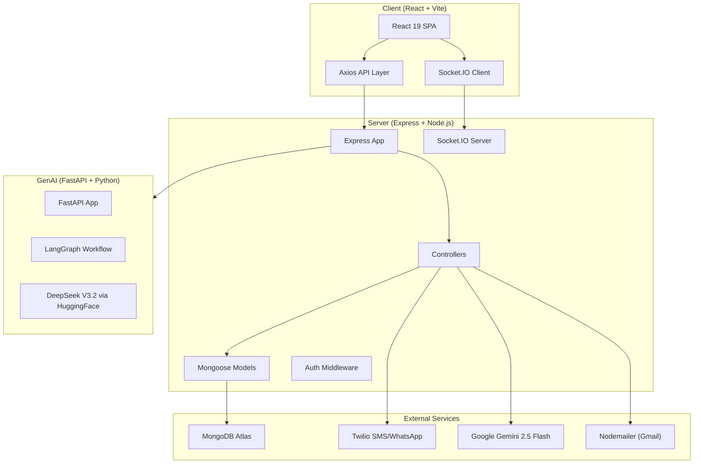
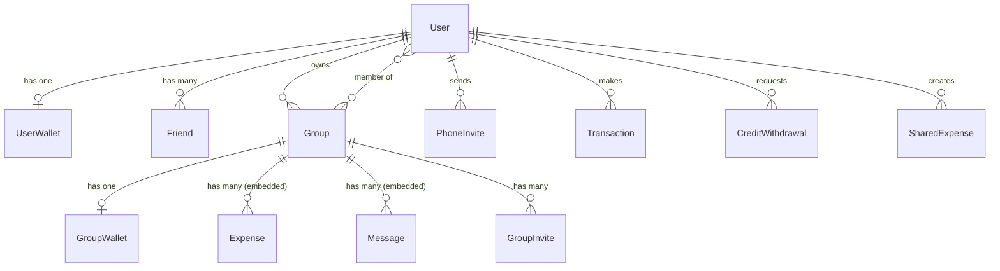
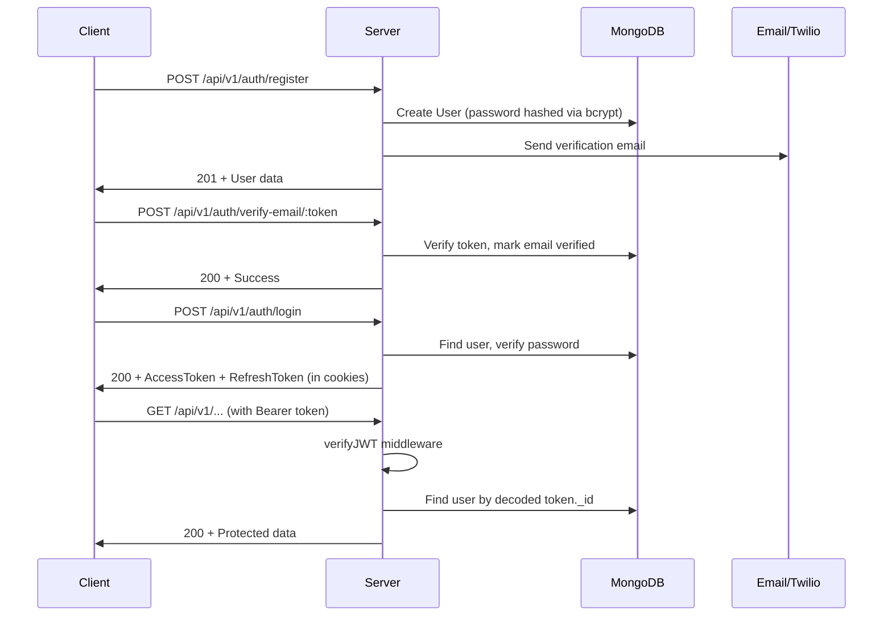

# 🔍 Comprehensive Project Analysis — Tsec Hacks 2026

> **Project**: Expense Splitting & Group Finance Management App
> **Author**: Sanskar Gambhir
> **Analysis Date**: July 1, 2026
> **Total Files Analyzed**: ~120+ source files across 3 services

---

## 📋 Table of Contents

1. [Executive Summary](#1-executive-summary)
2. [Project Overview & Architecture](#2-project-overview--architecture)
3. [Directory Structure](#3-directory-structure)
4. [Technology Stack](#4-technology-stack)
5. [Feature Analysis](#5-feature-analysis)
6. [Server-Side Deep Dive](#6-server-side-deep-dive)
7. [Client-Side Deep Dive](#7-client-side-deep-dive)
8. [GenAI Service Deep Dive](#8-genai-service-deep-dive)
9. [Database Design Analysis](#9-database-design-analysis)
10. [Authentication & Security](#10-authentication--security)
11. [Real-Time Features (Socket.IO)](#11-real-time-features-socketio)
12. [Third-Party Integrations](#12-third-party-integrations)
13. [🐛 Bugs & Issues](#13--bugs--issues)
14. [🔒 Security Vulnerabilities](#14--security-vulnerabilities)
15. [⚡ Performance Concerns](#15--performance-concerns)
16. [📐 Code Quality Issues](#16--code-quality-issues)
17. [🚧 Missing & Incomplete Features](#17--missing--incomplete-features)
18. [📖 Documentation Analysis](#18--documentation-analysis)
19. [🎯 Prioritized Improvement Recommendations](#19--prioritized-improvement-recommendations)
20. [Conclusion](#20-conclusion)

---

## 1. Executive Summary

This is a **full-stack expense splitting and group finance management application** built for the TSEC Hackathon 2026. The project is ambitious in scope, combining group fund pooling, splitwise-style expense tracking, AI-powered bill scanning, real-time chat, wallet management, and friend systems.

### Strengths
- ✅ Well-structured MVC architecture on the server
- ✅ Rich feature set covering multiple financial use-cases
- ✅ Good use of modern tech stack (React 19, Express, MongoDB, Socket.IO)
- ✅ AI integration via both Gemini API and a separate LangGraph service
- ✅ Comprehensive API design with proper versioning (`/api/v1/`)
- ✅ Good documentation with system guides for friend, invite, and phone systems

### Critical Issues
- ❌ **Duplicate route registrations** in [app.js](file:///c:/Projects/Tsec%20Hacks%202026/server/src/app.js) (lines 51-57)
- ❌ **Duplicate filename**: [Wallet.jsx](file:///c:/Projects/Tsec%20Hacks%202026/client/src/pages/Wallet.jsx) and [Walllet.jsx](file:///c:/Projects/Tsec%20Hacks%202026/client/src/pages/Walllet.jsx) (typo)
- ❌ **No route protection** — any unauthenticated user can access all client routes
- ❌ **Exposed `.env` file** in the server directory with sensitive credentials
- ❌ **No input validation** on most API endpoints (empty validators folder)
- ❌ **Race conditions** in wallet balance operations (no transactions/locking)
- ❌ **GenAI service returns `None` LLM** silently, causing unhandled crashes

---

## 2. Project Overview & Architecture

The application follows a **three-service architecture**:



### Data Flow
1. **Client** → Axios HTTP requests → **Server** Express API endpoints
2. **Client** ↔ Socket.IO ↔ **Server** for real-time group updates & chat
3. **Server** → Gemini API for bill parsing & AI insights
4. **Server** → Python GenAI service for LangGraph-based chat workflows
5. **Server** → Twilio for OTP verification & WhatsApp invites
6. **Server** → Nodemailer for email verification & friend invites

---

## 3. Directory Structure

```
Tsec Hacks 2026/
├── .github/
│   └── copilot-instructions.md          # AI coding guidelines
├── client/                               # React Frontend (Vite)
│   ├── src/
│   │   ├── api/                          # 6 API service modules
│   │   │   ├── axios.js                  # Axios instance config
│   │   │   ├── auth.js                   # Auth API calls
│   │   │   ├── groups.js                 # Group API calls
│   │   │   ├── friends.js               # Friend API calls
│   │   │   ├── activity.js              # Activity API calls
│   │   │   └── aiInsights.js            # AI Insights API calls
│   │   ├── components/                   # 8 feature components + 2 subdirs
│   │   │   ├── layout/                   # MainLayout, Sidebar, TopBar
│   │   │   ├── ui/                       # 16 shadcn/ui components
│   │   │   ├── GroupDetailPage.jsx       # 74KB - MASSIVE component
│   │   │   ├── GroupPaymentModal.jsx     # Payment modal
│   │   │   ├── ExpenseDetailsModal.jsx   # Expense details
│   │   │   ├── GroupInvites.jsx          # Invite management
│   │   │   ├── JoinGroup.jsx            # Join group form
│   │   │   ├── MemberActionsModal.jsx   # Member actions
│   │   │   ├── SocketTestComponent.jsx  # Socket debugging
│   │   │   └── ExtractedBillPreview.jsx # Bill preview
│   │   ├── context/                      # EMPTY - unused
│   │   ├── lib/
│   │   │   ├── socket.js                # Socket.IO client setup
│   │   │   └── utils.ts                 # shadcn cn() utility (TypeScript!)
│   │   ├── pages/                        # 20 page components
│   │   │   ├── Login.jsx
│   │   │   ├── SignUp.jsx
│   │   │   ├── Dashboard.jsx
│   │   │   ├── Groups.jsx
│   │   │   ├── GroupDetails.jsx          # Unused! Different from GroupDetailPage
│   │   │   ├── CreateGroup.jsx           # 30KB - very large
│   │   │   ├── FriendsPage.jsx
│   │   │   ├── Wallet.jsx                # 15KB - separate from Walllet.jsx
│   │   │   ├── Walllet.jsx               # ⚠️ TYPO - this is the one actually used
│   │   │   ├── Profile.jsx
│   │   │   ├── Activity.jsx
│   │   │   ├── AIInsights.jsx
│   │   │   ├── BillScanner.jsx
│   │   │   ├── BillSplit.jsx
│   │   │   ├── CreateSharedExpense.jsx
│   │   │   ├── ViewSharedExpense.jsx
│   │   │   ├── GroupChat.jsx
│   │   │   ├── GroupInviteHandler.jsx
│   │   │   ├── InviteHandler.jsx
│   │   │   └── SplitwiseSync.jsx
│   │   └── utils/
│   │       └── billParser.js
│   ├── Documents/
│   │   ├── Client-Architecture-Report.html
│   │   └── Steps-1.txt
│   ├── package.json
│   ├── vite.config.js
│   └── components.json                  # shadcn/ui config
│
├── server/                               # Express Backend
│   ├── src/
│   │   ├── controllers/                  # 13 controller files
│   │   ├── models/                       # 10 Mongoose models
│   │   ├── routes/                       # 13 route files
│   │   ├── middlewares/
│   │   │   └── auth.middleware.js        # JWT verification
│   │   ├── utils/                        # 9 utility modules
│   │   │   ├── api-error.js
│   │   │   ├── api-response.js
│   │   │   ├── asyncHandler.js
│   │   │   ├── axios.js
│   │   │   ├── constants.js
│   │   │   ├── gemini.js                 # Gemini AI integration
│   │   │   ├── mail.js                   # Nodemailer setup
│   │   │   ├── splitEngine.js            # Expense split calculator
│   │   │   └── twilio.js                 # SMS/WhatsApp
│   │   ├── db/
│   │   │   └── index.js                  # MongoDB connection
│   │   ├── app.js                        # Express app setup
│   │   ├── index.js                      # Server entry point
│   │   └── socket.js                     # Socket.IO setup
│   ├── PRD.md                            # Product Requirements
│   └── package.json
│
├── genai/                                # Python AI Service
│   ├── app/
│   │   ├── api/
│   │   │   ├── chat.py                   # Chat endpoint
│   │   │   └── workflow.py               # Workflow endpoint
│   │   ├── core/
│   │   │   ├── graph.py                  # LangGraph state machine
│   │   │   └── llm.py                    # LLM configuration
│   │   ├── schemas/
│   │   │   └── chat.py                   # Pydantic schemas
│   │   └── main.py                       # FastAPI entry
│   └── requirements.txt
│
├── FRIEND_SYSTEM_GUIDE.md
├── GROUP_INVITE_SYSTEM.md
├── PHONE_INVITE_SYSTEM.md
└── Bill.jpeg                             # Sample bill image
```

---

## 4. Technology Stack

### Client

| Technology | Version | Purpose |
|---|---|---|
| React | 19.2.0 | UI framework |
| Vite | 7.2.4 | Build tool & dev server |
| React Router DOM | 7.11.0 | Client-side routing |
| Tailwind CSS | 4.1.18 | Utility-first CSS |
| shadcn/ui (Radix) | Various | UI component library |
| Framer Motion | 12.31.0 | Animations |
| Recharts | 3.7.0 | Data visualization/charts |
| Axios | 1.13.2 | HTTP client |
| Socket.IO Client | 4.8.3 | Real-time communication |
| Tesseract.js | 7.0.0 | Client-side OCR |
| Lucide React | 0.562.0 | Icons |
| React Hot Toast | 2.6.0 | Toast notifications |
| React Day Picker | 9.13.0 | Date picker component |

### Server

| Technology | Version | Purpose |
|---|---|---|
| Express | 4.22.1 | Web framework |
| Mongoose | 9.0.2 | MongoDB ODM |
| Socket.IO | 4.8.3 | WebSocket server |
| JWT (jsonwebtoken) | 9.0.3 | Authentication tokens |
| bcrypt | 6.0.0 | Password hashing |
| Twilio | 5.12.0 | SMS/WhatsApp/OTP |
| Nodemailer | 7.0.12 | Email sending |
| Mailgen | 2.0.32 | Email templating |
| Google Generative AI | 0.24.1 | Gemini AI for bill parsing |
| Axios | 1.13.2 | HTTP client (for GenAI calls) |
| js-sha3 | 0.9.3 | SHA-3 hashing |
| Cookie Parser | 1.4.7 | Cookie handling |
| CORS | 2.8.5 | Cross-origin requests |
| dotenv | 17.2.3 | Environment variables |

### GenAI Service

| Technology | Version | Purpose |
|---|---|---|
| FastAPI | 0.115.12 | Python web framework |
| LangChain | 0.3.25 | LLM orchestration |
| LangGraph | 0.4.1 | Agent state machine |
| LangChain OpenAI | 0.3.18 | OpenAI-compatible LLM wrapper |
| Pydantic | 2.11.3 | Data validation |
| Uvicorn | 0.34.3 | ASGI server |
| python-dotenv | 1.1.0 | Environment variables |

---

## 5. Feature Analysis

### 5.1 Authentication System
| Feature | Status | Details |
|---|---|---|
| Email/Password Registration | ✅ Complete | With bcrypt hashing |
| Email Verification | ✅ Complete | Token-based via Nodemailer |
| Phone OTP Verification | ✅ Complete | Via Twilio Verify |
| JWT Access Tokens | ✅ Complete | Short-lived tokens |
| JWT Refresh Tokens | ✅ Complete | For token renewal |
| Login | ✅ Complete | Email + password |
| Forgot Password | ✅ Complete | Token-based reset via email |
| Password Reset | ✅ Complete | With token verification |
| Logout | ✅ Complete | Clears refresh token |

### 5.2 Group Management
| Feature | Status | Details |
|---|---|---|
| Create Group | ✅ Complete | With rules, pool, milestones |
| Pooling Groups | ✅ Complete | Shared pool with contributions |
| Splitwise Groups | ✅ Complete | Expense tracking & splitting |
| Time-Locked Groups | ✅ Complete | Funds locked until date |
| Milestone Groups | ✅ Complete | Target-based fund release |
| Group Rules | ✅ Complete | Configurable spending rules |
| Add/Remove Members | ✅ Complete | Owner-managed |
| Group Invites (Email) | ✅ Complete | Token-based email invites |
| Group Invites (Phone/WhatsApp) | ✅ Complete | Via Twilio WhatsApp |
| Group Chat | ✅ Complete | Real-time via Socket.IO |
| Group Expenses | ✅ Complete | Add, track, split expenses |
| Group Wallet | ✅ Complete | Separate group wallet per group |

### 5.3 Wallet System
| Feature | Status | Details |
|---|---|---|
| User Wallet | ✅ Complete | Per-user with balance |
| Add Funds | ✅ Complete | Simulated (no real payment gateway) |
| Withdraw Funds | ✅ Complete | Balance deduction |
| Transfer to Group | ✅ Complete | Wallet → Group pool |
| Transaction History | ✅ Complete | Full ledger tracking |
| Wallet Freeze | ⚠️ Partial | Schema supports it, no UI |

### 5.4 Friend System
| Feature | Status | Details |
|---|---|---|
| Send Friend Request | ✅ Complete | By email or phone |
| Accept/Reject Request | ✅ Complete | Full flow |
| Friend List | ✅ Complete | View all friends |
| Invite via Email | ✅ Complete | Non-registered users |
| Invite via Phone | ✅ Complete | WhatsApp invites |
| Remove Friend | ✅ Complete | Unfriend functionality |
| Search Friends | ✅ Complete | By email |

### 5.5 AI Features
| Feature | Status | Details |
|---|---|---|
| Bill Scanning (OCR) | ✅ Complete | Tesseract.js + Gemini parsing |
| AI Bill Parsing | ✅ Complete | Gemini 2.5 Flash structured extraction |
| AI Spending Insights | ✅ Complete | Spending pattern analysis |
| AI Budget Suggestions | ✅ Complete | Budget recommendations |
| AI Chat (GenAI Service) | ⚠️ Partial | LangGraph setup exists but minimal |

### 5.6 Other Features
| Feature | Status | Details |
|---|---|---|
| Activity Feed | ✅ Complete | Recent actions across groups |
| Shared Expenses | ✅ Complete | Create sharable expense links |
| Bill Split | ✅ Complete | Even/custom/exclude methods |
| Credit Withdrawals | ⚠️ Partial | Schema + controller exists |
| User Profile | ✅ Complete | View & update profile |
| Splitwise Sync | ⚠️ Partial | UI exists, no backend integration |
| Dashboard | ✅ Complete | Overview with charts |

---

## 6. Server-Side Deep Dive

### 6.1 Express Application Setup
[app.js](file:///c:/Projects/Tsec%20Hacks%202026/server/src/app.js)

The Express app is configured with:
- **CORS**: Allows `localhost:5173`, `localhost:5174`, and a configurable `CORS_ORIGIN`
- **Body parsing**: JSON and URL-encoded with 16KB limit
- **Cookie parsing**: For JWT token extraction
- **Static files**: From `public/` directory
- **13 route modules** mounted under `/api/v1/`

> [!CAUTION]
> **Duplicate Route Registration Bug** (Lines 51-57): Three route modules are registered **twice**:
> ```javascript
> app.use("/api/v1/credit-withdrawals", creditWithdrawalRouter); // Line 51
> app.use("/api/v1/user", userProfileRouter);                    // Line 52
> app.use("/api/v1/activity", activityRouter);                   // Line 53
> app.use("/api/v1/credit-withdrawals", creditWithdrawalRouter); // Line 55 ← DUPLICATE
> app.use("/api/v1/user", userProfileRouter);                    // Line 56 ← DUPLICATE
> app.use("/api/v1/activity", activityRouter);                   // Line 57 ← DUPLICATE
> ```
> This causes each request to these routes to be processed twice, leading to potential double responses or unexpected behavior.

### 6.2 Server Entry Point
[index.js](file:///c:/Projects/Tsec%20Hacks%202026/server/src/index.js)

- Loads environment variables via `dotenv`
- Connects to MongoDB via the `connectDB()` function
- Creates HTTP server from Express app
- Initializes Socket.IO
- Starts listening on `process.env.PORT`

### 6.3 Controller Analysis

#### Group Controller — [group.controllers.js](file:///c:/Projects/Tsec%20Hacks%202026/server/src/controllers/group.controllers.js)
**Largest file: 1,495 lines / 42KB** — This is the most complex controller with the following operations:
- `createGroup` — Creates group with pool, rules, milestones; deducts pool from owner wallet
- `getGroupById` — Fetches group with populated members/expenses
- `joinGroup` — Members join via group ID
- `addExpense` — Adds expenses with even/custom/exclude division methods
- `deleteExpense` — Removes expenses
- `addMessage` — Adds chat messages to group
- `getMessages` — Retrieves group messages
- `addRule` — Adds spending rules with Socket.IO broadcast
- `depositToGroup` — User wallet → group pool transfer
- `inviteByEmail` — Email-based group invitations
- `inviteByPhone` — WhatsApp-based invitations
- `acceptInvite` / `rejectInvite` — Invitation management
- `getGroupInvites` — List pending invites
- `getMyGroups` — User's groups list
- `settleSplitwise` — Splitwise balance settlement
- `checkTimeLockRelease` — Time-locked fund release
- `completeMilestone` — Milestone completion handler
- `leaveGroup` — Member departure
- `getGroupWallet` — Group wallet details

#### Auth Controller — [auth.controllers.js](file:///c:/Projects/Tsec%20Hacks%202026/server/src/controllers/auth.controllers.js)
- Full registration with email + phone + PAN card
- Email verification with token + expiry
- Phone OTP via Twilio Verify
- Login with JWT access + refresh tokens
- Password reset flow via email
- Token refresh endpoint
- Logout with cookie clearing

#### Wallet Controller — [wallet.controllers.js](file:///c:/Projects/Tsec%20Hacks%202026/server/src/controllers/wallet.controllers.js)
- Create wallet, get balance, add funds, withdraw
- Transfer to user, get transaction history
- **No real payment gateway** — funds are simulated

#### Friend Controller — [friend.controllers.js](file:///c:/Projects/Tsec%20Hacks%202026/server/src/controllers/friend.controllers.js)
- Send/accept/reject friend requests
- Remove friends
- Invite non-registered users via email or phone
- Search users
- List friends and pending requests

#### AI Insights Controller — [aiInsights.controllers.js](file:///c:/Projects/Tsec%20Hacks%202026/server/src/controllers/aiInsights.controllers.js)
- Aggregates user's group expenses
- Sends to GenAI Python service for analysis
- Returns spending insights and recommendations

### 6.4 Utility Modules

| File | Purpose | Issues |
|---|---|---|
| [api-error.js](file:///c:/Projects/Tsec%20Hacks%202026/server/src/utils/api-error.js) | Custom `ApiError` class extending `Error` | None |
| [api-response.js](file:///c:/Projects/Tsec%20Hacks%202026/server/src/utils/api-response.js) | Standardized `ApiResponse` class | None |
| [asyncHandler.js](file:///c:/Projects/Tsec%20Hacks%202026/server/src/utils/asyncHandler.js) | Async error wrapper for Express routes | None |
| [gemini.js](file:///c:/Projects/Tsec%20Hacks%202026/server/src/utils/gemini.js) | Gemini 2.5 Flash bill text analysis | ⚠️ No error handling for missing API key |
| [twilio.js](file:///c:/Projects/Tsec%20Hacks%202026/server/src/utils/twilio.js) | OTP, SMS, WhatsApp via Twilio | ⚠️ Debug logs left in code |
| [mail.js](file:///c:/Projects/Tsec%20Hacks%202026/server/src/utils/mail.js) | Email verification & invites via Nodemailer | None |
| [splitEngine.js](file:///c:/Projects/Tsec%20Hacks%202026/server/src/utils/splitEngine.js) | Expense split calculations | ⚠️ Minimal — only even split |
| [constants.js](file:///c:/Projects/Tsec%20Hacks%202026/server/src/utils/constants.js) | User roles & task statuses | ⚠️ Contains `TaskStatusEnum` which is unused |
| [axios.js](file:///c:/Projects/Tsec%20Hacks%202026/server/src/utils/axios.js) | Axios instance for GenAI service | None |

---

## 7. Client-Side Deep Dive

### 7.1 Application Structure
[App.jsx](file:///c:/Projects/Tsec%20Hacks%202026/client/src/App.jsx)

The app uses `react-router-dom` v7 with a flat route structure:

```
/ → Redirects to /login
/login → Login page
/signup → SignUp page
/invite/:token → Friend invite handler
/group-invite/:token → Group invite handler
/chat/:groupId → Group chat (NO layout)
/socket-test → Socket debugging component
/join-group → Join group form
/group/:groupId → Group detail page (NO layout)
/shared-expense/:shareLink → View shared expense
/split-bills → Create shared expense

── MainLayout ──
  /dashboard → Dashboard
  /groups → Groups list
  /wallet → Wallet page
  /groups/create → Create group
  /groups/:groupId → Group detail (DUPLICATE route)
  /friends → Friends page
  /wallet → Wallet (DUPLICATE route)
  /activity → Activity feed
  /ai-insights → AI Insights
  /profile → User profile
  /scan-bill → Bill scanner
  /splitwise → Splitwise sync
```

> [!WARNING]
> **Route Issues Found**:
> 1. `/wallet` is registered **twice** (lines 48 and 52)
> 2. `/groups/:groupId` exists both inside and outside MainLayout (lines 40 and 50)
> 3. **No auth guards** — all routes accessible without login
> 4. `GroupDetails.jsx` (page) is imported but **never used** in routing
> 5. `BillSplit.jsx` (page) is **never routed to**
> 6. Import uses `Walllet` (typo) from `./pages/Walllet` (line 5)

### 7.2 Layout System
The layout consists of three components:

- [MainLayout.jsx](file:///c:/Projects/Tsec%20Hacks%202026/client/src/components/layout/MainLayout.jsx) — Sidebar + TopBar + `<Outlet />`
- [Sidebar.jsx](file:///c:/Projects/Tsec%20Hacks%202026/client/src/components/layout/Sidebar.jsx) — Navigation sidebar with links
- [TopBar.jsx](file:///c:/Projects/Tsec%20Hacks%202026/client/src/components/layout/TopBar.jsx) — Top navigation bar

### 7.3 API Layer
Six API modules using Axios:

| File | Endpoints |
|---|---|
| [axios.js](file:///c:/Projects/Tsec%20Hacks%202026/client/src/api/axios.js) | Base instance: `http://localhost:8000/api/v1` |
| [auth.js](file:///c:/Projects/Tsec%20Hacks%202026/client/src/api/auth.js) | `register`, `login`, `verifyEmail` |
| [groups.js](file:///c:/Projects/Tsec%20Hacks%202026/client/src/api/groups.js) | `getMyGroups`, `createGroup`, `getGroupById`, `addExpense`, `joinGroup` |
| [friends.js](file:///c:/Projects/Tsec%20Hacks%202026/client/src/api/friends.js) | `sendFriendRequest`, `acceptFriendRequest`, `rejectFriendRequest`, `removeFriend`, `getFriends`, `getPendingRequests`, `inviteByEmail`, `inviteByPhone`, `searchUsers` |
| [activity.js](file:///c:/Projects/Tsec%20Hacks%202026/client/src/api/activity.js) | `getActivities`, `getGroupActivities` |
| [aiInsights.js](file:///c:/Projects/Tsec%20Hacks%202026/client/src/api/aiInsights.js) | `getAIInsights`, `getGroupInsights`, `getAIChat` |

> [!NOTE]
> The Axios instance does NOT include automatic token injection. Each API call manually adds the `Authorization` header by reading from `localStorage`.

### 7.4 UI Component Library

The project uses **shadcn/ui** with Radix UI primitives. 16 UI components are set up in [client/src/components/ui/](file:///c:/Projects/Tsec%20Hacks%202026/client/src/components/ui/):

`avatar`, `badge`, `button`, `calendar`, `card`, `chart`, `dialog`, `input`, `label`, `progress`, `select`, `switch`, `table`, `tabs`, `textarea`, `Glow`

### 7.5 Key Page Analysis

| Page | Size | Complexity | Key Issues |
|---|---|---|---|
| [GroupDetailPage.jsx](file:///c:/Projects/Tsec%20Hacks%202026/client/src/components/GroupDetailPage.jsx) | **74KB** | Extremely High | Far too large — should be 10+ components |
| [GroupDetails.jsx](file:///c:/Projects/Tsec%20Hacks%202026/client/src/pages/GroupDetails.jsx) | 34KB | High | **Not used** — appears to be an older version |
| [CreateGroup.jsx](file:///c:/Projects/Tsec%20Hacks%202026/client/src/pages/CreateGroup.jsx) | 30KB | High | Multi-step form, very complex |
| [Activity.jsx](file:///c:/Projects/Tsec%20Hacks%202026/client/src/pages/Activity.jsx) | 24KB | Medium | Activity feed with filters |
| [FriendsPage.jsx](file:///c:/Projects/Tsec%20Hacks%202026/client/src/pages/FriendsPage.jsx) | 23KB | Medium | Friend management UI |
| [Profile.jsx](file:///c:/Projects/Tsec%20Hacks%202026/client/src/pages/Profile.jsx) | 23KB | Medium | User profile management |
| [AIInsights.jsx](file:///c:/Projects/Tsec%20Hacks%202026/client/src/pages/AIInsights.jsx) | 21KB | Medium | AI-powered spending analysis |
| [Dashboard.jsx](file:///c:/Projects/Tsec%20Hacks%202026/client/src/pages/Dashboard.jsx) | 18KB | Medium | Overview with Recharts |
| [Wallet.jsx](file:///c:/Projects/Tsec%20Hacks%202026/client/src/pages/Wallet.jsx) | 15KB | Medium | **NOT USED** — has correct name but not imported |
| [Walllet.jsx](file:///c:/Projects/Tsec%20Hacks%202026/client/src/pages/Walllet.jsx) | 12KB | Medium | **Actually used** — imported with typo |
| [BillScanner.jsx](file:///c:/Projects/Tsec%20Hacks%202026/client/src/pages/BillScanner.jsx) | 14KB | Medium | OCR + Gemini bill parsing |
| [SplitwiseSync.jsx](file:///c:/Projects/Tsec%20Hacks%202026/client/src/pages/SplitwiseSync.jsx) | 12KB | Medium | Splitwise integration UI |

### 7.6 Socket.IO Client
[socket.js](file:///c:/Projects/Tsec%20Hacks%202026/client/src/lib/socket.js)

Provides a singleton Socket.IO connection with:
- `connectSocket(token)` — Connects with JWT auth
- `disconnectSocket()` — Cleanup
- `joinGroup(groupId)` — Join Socket room
- `leaveGroup(groupId)` — Leave Socket room
- `onGroupUpdate(callback)` — Listen for updates
- `sendMessage(groupId, message, sender)` — Send chat messages
- `onNewMessage(callback)` — Listen for messages

---

## 8. GenAI Service Deep Dive

### 8.1 Architecture
The GenAI service is a **FastAPI** application using **LangGraph** for AI workflow orchestration:

[main.py](file:///c:/Projects/Tsec%20Hacks%202026/genai/app/main.py) — Minimal FastAPI app with two routers (chat, workflow)

### 8.2 LLM Configuration
[llm.py](file:///c:/Projects/Tsec%20Hacks%202026/genai/app/core/llm.py)

- Uses **DeepSeek V3.2** model via HuggingFace's router
- Wrapped in `ChatOpenAI` from LangChain (OpenAI-compatible API)
- Requires `HF_TOKEN` environment variable
- Max 1024 tokens output

> [!CAUTION]
> **Critical Bug**: When `HF_TOKEN` is missing, `get_llm()` returns `None` instead of raising an error. This `None` is then passed to the graph's `call_model` which calls `llm.invoke()` on `None`, causing an unhandled `AttributeError`.

### 8.3 LangGraph Workflow
[graph.py](file:///c:/Projects/Tsec%20Hacks%202026/genai/app/core/graph.py)

The graph is extremely simple:
```
START → agent (call_model) → END
```

This is essentially a single-turn LLM call wrapped in LangGraph. No tools, no conditional routing, no multi-step reasoning — just a pass-through to the LLM.

### 8.4 API Endpoints
- `POST /chat` — Simple chat endpoint
- `POST /workflow` — Workflow-based chat (uses the LangGraph)

Both accept `ChatRequest(message: str)` and return `ChatResponse(response: str)`.

### 8.5 Issues
1. The LangGraph workflow is **trivially simple** — it adds significant complexity (LangGraph dependency) for what is essentially `llm.invoke(messages)`
2. No system prompt is configured — the AI has no context about expense splitting
3. No conversation history — each request is standalone
4. No CORS configuration on FastAPI
5. No error handling for LLM failures
6. The service doesn't share MongoDB access — it can't actually analyze user data directly

---

## 9. Database Design Analysis

### 9.1 Schema Relationship Map



### 9.2 Model Details

| Model | File | Fields | Issues |
|---|---|---|---|
| **User** | [user.models.js](file:///c:/Projects/Tsec%20Hacks%202026/server/src/models/user.models.js) | avatar, username, email, phone, panCard, password, tokens | ⚠️ `email` has no unique index |
| **Group** | [group.models.js](file:///c:/Projects/Tsec%20Hacks%202026/server/src/models/group.models.js) | name, pool, ruleType, releaseType, milestones, rules, owner, members, expenses (embedded), messages (embedded) | ⚠️ Expenses & messages embedded — will hit 16MB BSON limit |
| **UserWallet** | [wallet.models.js](file:///c:/Projects/Tsec%20Hacks%202026/server/src/models/wallet.models.js) | user, balance, currency, status | ✅ Proper unique index on user |
| **EventWallet** | [wallet.models.js](file:///c:/Projects/Tsec%20Hacks%202026/server/src/models/wallet.models.js) | event (ref: "Event"), totalBalance, currency | ⚠️ References non-existent "Event" model |
| **EventMemberLedger** | [wallet.models.js](file:///c:/Projects/Tsec%20Hacks%202026/server/src/models/wallet.models.js) | event, user, deposited, spentShare, refundable, payable | ⚠️ References non-existent "Event" and "Category" models |
| **GroupWallet** | [groupWallet.models.js](file:///c:/Projects/Tsec%20Hacks%202026/server/src/models/groupWallet.models.js) | group, balance, contributions, transactions | ✅ Good design |
| **Transaction** | [transactions.models.js](file:///c:/Projects/Tsec%20Hacks%202026/server/src/models/transactions.models.js) | wallet, type, amount, description, reference | ✅ Good design |
| **Friend** | [friend.models.js](file:///c:/Projects/Tsec%20Hacks%202026/server/src/models/friend.models.js) | requester, recipient, status | ✅ Good design |
| **GroupInvite** | [groupInvite.models.js](file:///c:/Projects/Tsec%20Hacks%202026/server/src/models/groupInvite.models.js) | group, invitedBy, invitedUser/Email/Phone, token, status | ✅ Good design |
| **PhoneInvite** | [phoneInvite.models.js](file:///c:/Projects/Tsec%20Hacks%202026/server/src/models/phoneInvite.models.js) | inviter, phone, token, type, status | ✅ Good design |
| **SharedExpense** | [sharedExpense.models.js](file:///c:/Projects/Tsec%20Hacks%202026/server/src/models/sharedExpense.models.js) | creator, title, items, shareLink | ✅ Good design |
| **CreditWithdrawal** | [creditWithdrawal.models.js](file:///c:/Projects/Tsec%20Hacks%202026/server/src/models/creditWithdrawal.models.js) | user, amount, status, processedAt | ✅ Good design |

### 9.3 Schema Design Issues

> [!WARNING]
> **Embedded Documents Problem**: The `Group` model embeds `expenses` and `messages` as arrays within the group document. For active groups, this will hit MongoDB's **16MB BSON document size limit**. These should be separate collections with references.

> [!WARNING]
> **Orphaned Models**: `EventWallet` and `EventMemberLedger` reference `"Event"` and `"Category"` models that **do not exist** in the codebase. These appear to be leftover from an earlier design.

> [!IMPORTANT]
> **Missing Unique Index on User Email**: The `email` field in the User model lacks a `unique: true` constraint, potentially allowing duplicate email registrations.

---

## 10. Authentication & Security

### 10.1 Auth Flow



### 10.2 Token Strategy
- **Access Token**: Short-lived JWT with `{ _id, email, username }`
- **Refresh Token**: Longer-lived JWT with `{ _id }`
- Tokens stored in **HTTP-only cookies** + `Authorization` header support
- Client stores token in **localStorage** (security concern)

### 10.3 Password Security
- ✅ bcrypt with salt rounds of 10
- ✅ Password excluded from queries via `.select('-password')`
- ✅ Password hashing in pre-save hook

---

## 11. Real-Time Features (Socket.IO)

### 11.1 Server Events
[socket.js](file:///c:/Projects/Tsec%20Hacks%202026/server/src/socket.js)

| Event | Direction | Purpose |
|---|---|---|
| `connection` | Client → Server | Socket connection established |
| `joinGroup` | Client → Server | Join a group room |
| `leaveGroup` | Client → Server | Leave a group room |
| `ruleAdded` | Client → Server → Group | Broadcast rule addition |
| `memberJoined` | Client → Server → Group | Broadcast member joining |
| `memberLeft` | Client → Server → Group | Broadcast member leaving |
| `sendMessage` | Client → Server → Group | Send chat message |
| `newMessage` | Server → Group | New message notification |
| `disconnect` | Client → Server | Socket disconnection |

### 11.2 Issues
1. **No authentication** on Socket.IO connections — anyone can join any group room
2. **No message persistence** via Socket.IO — messages sent via socket aren't saved to DB (only via REST API)
3. **Duplicate message events**: Both `sendMessage` and `newMessage` handle similar functionality
4. **No typing indicators** or presence tracking
5. **No reconnection handling** on the client side

---

## 12. Third-Party Integrations

### 12.1 Google Gemini AI
[gemini.js](file:///c:/Projects/Tsec%20Hacks%202026/server/src/utils/gemini.js)

- **Model**: `gemini-2.5-flash`
- **Use Case**: Bill/receipt text parsing from OCR output
- **Prompt**: Structured prompt requesting JSON output with vendor, date, total, tax, items
- **Config**: Temperature 0 for deterministic output, `application/json` MIME type
- **Issue**: The `members` parameter is accepted but **never used** in the prompt

### 12.2 Twilio
[twilio.js](file:///c:/Projects/Tsec%20Hacks%202026/server/src/utils/twilio.js)

- **OTP**: Twilio Verify service for phone number verification
- **SMS**: Direct message sending
- **WhatsApp**: Group invitations via WhatsApp Business API
- **Issue**: Debug `console.log` statements left in `sendWhatsApp`

### 12.3 Email (Nodemailer + Mailgen)
[mail.js](file:///c:/Projects/Tsec%20Hacks%202026/server/src/utils/mail.js)

- **Provider**: Gmail SMTP via Nodemailer
- **Templates**: Mailgen for professional email templates
- **Use Cases**: Email verification, friend invites, password reset
- **Issue**: Uses Gmail credentials directly — not suitable for production

---

## 13. 🐛 Bugs & Issues

### Critical Bugs

| # | Bug | File | Severity |
|---|---|---|---|
| 1 | **Duplicate route registrations** — `creditWithdrawal`, `userProfile`, and `activity` routes registered twice | [app.js](file:///c:/Projects/Tsec%20Hacks%202026/server/src/app.js) L51-57 | 🔴 Critical |
| 2 | **Duplicate `/wallet` route** — registered on lines 48 AND 52 in App.jsx routing | [App.jsx](file:///c:/Projects/Tsec%20Hacks%202026/client/src/App.jsx) L48, L52 | 🔴 Critical |
| 3 | **Filename typo `Walllet.jsx`** — the actual wallet page has a triple-L typo and is the one imported | [Walllet.jsx](file:///c:/Projects/Tsec%20Hacks%202026/client/src/pages/Walllet.jsx), [App.jsx](file:///c:/Projects/Tsec%20Hacks%202026/client/src/App.jsx) L5 | 🟡 Medium |
| 4 | **GenAI `get_llm()` returns `None`** when `HF_TOKEN` is missing, causing `AttributeError` on `.invoke()` | [llm.py](file:///c:/Projects/Tsec%20Hacks%202026/genai/app/core/llm.py) L12 | 🔴 Critical |
| 5 | **Race condition in wallet operations** — concurrent deposits/withdrawals can corrupt balance (no atomic operations or locking) | [wallet.controllers.js](file:///c:/Projects/Tsec%20Hacks%202026/server/src/controllers/wallet.controllers.js) | 🔴 Critical |
| 6 | **`EventWallet` references non-existent `"Event"` model** — will cause runtime errors if ever used | [wallet.models.js](file:///c:/Projects/Tsec%20Hacks%202026/server/src/models/wallet.models.js) L35 | 🟡 Medium |
| 7 | **`GroupDetails.jsx` imported but never used** — dead import taking up bundle space | [App.jsx](file:///c:/Projects/Tsec%20Hacks%202026/client/src/App.jsx) L12 | 🟢 Low |
| 8 | **`BillSplit.jsx` exists but has no route** — the page is unreachable | [BillSplit.jsx](file:///c:/Projects/Tsec%20Hacks%202026/client/src/pages/BillSplit.jsx) | 🟡 Medium |
| 9 | **`Wallet.jsx` (correct name) exists but is never imported** — [Walllet.jsx](file:///c:/Projects/Tsec%20Hacks%202026/client/src/pages/Walllet.jsx) is used instead | [Wallet.jsx](file:///c:/Projects/Tsec%20Hacks%202026/client/src/pages/Wallet.jsx) | 🟡 Medium |
| 10 | **Gemini `members` param is unused** — `analyzeBillText(rawText, members)` accepts members but never includes them in the prompt | [gemini.js](file:///c:/Projects/Tsec%20Hacks%202026/server/src/utils/gemini.js) L5 | 🟢 Low |

### Logic Errors

| # | Issue | File | Details |
|---|---|---|---|
| 11 | **`spentBy` field commented out as required** in expense schema | [group.models.js](file:///c:/Projects/Tsec%20Hacks%202026/server/src/models/group.models.js) L31 | `// required: true` — expenses can be created without knowing who spent |
| 12 | **Constants define `TaskStatusEnum`** that is never used anywhere | [constants.js](file:///c:/Projects/Tsec%20Hacks%202026/server/src/utils/constants.js) L13-19 | Dead code from a template |
| 13 | **Package name is `"projectmangement"`** — misspelled | [server/package.json](file:///c:/Projects/Tsec%20Hacks%202026/server/package.json) L2 | "projectmangement" instead of "projectmanagement" |
| 14 | **Client package name is `"initialisation"`** — generic template name | [client/package.json](file:///c:/Projects/Tsec%20Hacks%202026/client/package.json) L2 | Not descriptive |
| 15 | **JSON body limit 16KB** may be too small for bill scanning payloads | [app.js](file:///c:/Projects/Tsec%20Hacks%202026/server/src/app.js) L37 | OCR text from large receipts might exceed this |

---

## 14. 🔒 Security Vulnerabilities

| # | Vulnerability | Severity | Details |
|---|---|---|---|
| 1 | **No route protection on client** — all dashboard routes accessible without login | 🔴 Critical | App.jsx has no `ProtectedRoute` wrapper |
| 2 | **JWT stored in localStorage** — vulnerable to XSS attacks | 🔴 Critical | Should use HTTP-only cookies exclusively |
| 3 | **No input validation** — validators directory is empty | 🔴 Critical | No express-validator or joi schema validation on any endpoint |
| 4 | **CORS allows hardcoded localhost origins** — should use env-only in production | 🟡 Medium | [app.js](file:///c:/Projects/Tsec%20Hacks%202026/server/src/app.js) L23-27 |
| 5 | **Socket.IO has no authentication** — any client can join any group room | 🔴 Critical | [socket.js](file:///c:/Projects/Tsec%20Hacks%202026/server/src/socket.js) |
| 6 | **No rate limiting** on any endpoint — vulnerable to brute force attacks | 🔴 Critical | Login, OTP, registration all lack rate limiting |
| 7 | **Gmail credentials used for email** — not suitable for production | 🟡 Medium | [mail.js](file:///c:/Projects/Tsec%20Hacks%202026/server/src/utils/mail.js) |
| 8 | **PAN card stored in plain text** — sensitive financial identifier | 🔴 Critical | [user.models.js](file:///c:/Projects/Tsec%20Hacks%202026/server/src/models/user.models.js) L38-43 |
| 9 | **No HTTPS enforcement** | 🟡 Medium | Server only listens on HTTP |
| 10 | **Missing unique constraint on user email** — duplicate accounts possible | 🟡 Medium | [user.models.js](file:///c:/Projects/Tsec%20Hacks%202026/server/src/models/user.models.js) L26-31 |
| 11 | **Commented debug `console.log` with credentials context** in Twilio | 🟢 Low | [twilio.js](file:///c:/Projects/Tsec%20Hacks%202026/server/src/utils/twilio.js) L11-13 |
| 12 | **No CSRF protection** | 🟡 Medium | No CSRF tokens for state-changing operations |
| 13 | **GenAI FastAPI has no CORS config** — may block cross-origin requests | 🟡 Medium | [main.py](file:///c:/Projects/Tsec%20Hacks%202026/genai/app/main.py) |

---

## 15. ⚡ Performance Concerns

| # | Issue | Impact | Details |
|---|---|---|---|
| 1 | **Embedded messages/expenses in Group** — documents will grow unboundedly | 🔴 High | [group.models.js](file:///c:/Projects/Tsec%20Hacks%202026/server/src/models/group.models.js) — Will hit 16MB BSON limit |
| 2 | **GroupDetailPage.jsx is 74KB** — extremely large single component | 🔴 High | Should be split into 10+ smaller components. Causes slow initial render and poor code splitting |
| 3 | **No pagination** on activity feeds, expense lists, or message lists | 🟡 Medium | All data loaded at once — will slow down with growth |
| 4 | **Missing database indexes** — queries on email, phone, group members lack compound indexes | 🟡 Medium | Slow lookups as data grows |
| 5 | **LLM instantiated per request** in GenAI service | 🟡 Medium | [llm.py](file:///c:/Projects/Tsec%20Hacks%202026/genai/app/core/llm.py) — `get_llm()` creates a new instance each call |
| 6 | **No lazy loading** of page components in React router | 🟡 Medium | All 20 pages loaded eagerly in the initial bundle |
| 7 | **Multiple wallet lookups** without caching in group operations | 🟢 Low | [group.controllers.js](file:///c:/Projects/Tsec%20Hacks%202026/server/src/controllers/group.controllers.js) |
| 8 | **N+1 query patterns** in activity and insights controllers | 🟡 Medium | Multiple separate DB queries instead of aggregation |
| 9 | **Tesseract.js (OCR) runs client-side** — heavy compute on user's browser | 🟡 Medium | [BillScanner.jsx](file:///c:/Projects/Tsec%20Hacks%202026/client/src/pages/BillScanner.jsx) — 7MB+ WASM download |
| 10 | **No connection pooling** for MongoDB | 🟢 Low | Mongoose handles this by default, but no explicit config |

---

## 16. 📐 Code Quality Issues

### 16.1 Naming Inconsistencies

| Issue | Examples |
|---|---|
| File naming pattern mix | `bill.controller.js` vs `auth.controllers.js` (singular vs plural) |
| Package name typo | `"projectmangement"` in server package.json |
| Filename typo | `Walllet.jsx` (triple L) |
| Client package name | `"initialisation"` — generic template name |
| Mixed language extensions | `.jsx` files + one `.ts` file ([utils.ts](file:///c:/Projects/Tsec%20Hacks%202026/client/src/lib/utils.ts)) |

### 16.2 Code Duplication
- Two wallet page files: `Wallet.jsx` (15KB, unused) and `Walllet.jsx` (12KB, used)
- `GroupDetails.jsx` (page, 34KB, unused) and `GroupDetailPage.jsx` (component, 74KB, used) — overlapping functionality
- Duplicate route registrations in `app.js`
- Similar socket event patterns (`sendMessage` vs `newMessage`)

### 16.3 Empty/Unused Directories
- `client/src/context/` — **completely empty** (no React Context providers)
- `server/src/validators/` — **completely empty** (no validation schemas)
- `server/public/Images/` — **empty** (no uploaded images)

### 16.4 Monolithic Components
- [GroupDetailPage.jsx](file:///c:/Projects/Tsec%20Hacks%202026/client/src/components/GroupDetailPage.jsx) at **74KB** is extremely oversized. A single component file should ideally be under 500 lines. This file likely exceeds 2,000 lines.
- [CreateGroup.jsx](file:///c:/Projects/Tsec%20Hacks%202026/client/src/pages/CreateGroup.jsx) at **30KB** is also very large.

### 16.5 State Management
- **No global state management** — no Context API usage, no Redux, no Zustand
- The `context/` directory is empty
- Auth state stored in `localStorage` without a proper auth context
- Each page independently fetches data — no shared state between sibling routes

### 16.6 Dead Code
- `TaskStatusEnum` and `AvailableTaskStatuses` in constants.js
- `UserRolesEnum` defined but never enforced in any middleware
- `EventWallet` and `EventMemberLedger` models (reference non-existent models)
- `GroupDetails.jsx` page (never routed to)
- `Wallet.jsx` page (correct filename but never imported)
- `BillSplit.jsx` page (no route defined)

---

## 17. 🚧 Missing & Incomplete Features

| Feature | Status | What's Missing |
|---|---|---|
| **Route Protection** | ❌ Missing | No `ProtectedRoute` HOC or auth guard middleware on client |
| **Auth Context** | ❌ Missing | Empty `context/` directory; no shared auth state |
| **Input Validation** | ❌ Missing | Empty `validators/` directory; no server-side validation |
| **Error Boundaries** | ❌ Missing | No React error boundaries for crash handling |
| **Loading States** | ⚠️ Partial | Inconsistent loading indicators across pages |
| **Splitwise Sync** | ⚠️ Partial | UI exists in [SplitwiseSync.jsx](file:///c:/Projects/Tsec%20Hacks%202026/client/src/pages/SplitwiseSync.jsx) but no actual Splitwise API integration |
| **Payment Gateway** | ❌ Missing | Wallet funds are simulated — no Razorpay/Stripe integration |
| **File Upload** | ❌ Missing | No image upload for avatars, receipts, etc. |
| **Push Notifications** | ❌ Missing | No FCM/Web Push for group updates |
| **Unit Tests** | ❌ Missing | Zero test files in the entire project |
| **Integration Tests** | ❌ Missing | No API test suite |
| **CI/CD Pipeline** | ❌ Missing | `.github/` exists but no workflows |
| **Docker Support** | ❌ Missing | No Dockerfile or docker-compose |
| **API Documentation** | ❌ Missing | No Swagger/OpenAPI spec |
| **Responsive Design** | ⚠️ Partial | Layout exists but mobile responsiveness is unclear |
| **Accessibility** | ❌ Missing | No ARIA labels, no keyboard navigation, no screen reader support |
| **Internationalization** | ❌ Missing | Hardcoded English text, INR currency |
| **Logging** | ⚠️ Partial | Only `console.log` — no structured logging (Winston/Pino) |
| **Environment Validation** | ❌ Missing | No startup check for required env vars |
| **GenAI Context** | ❌ Missing | AI chat has no context about the app or user data |
| **Conversation History** | ❌ Missing | GenAI service doesn't maintain chat history |

---

## 18. 📖 Documentation Analysis

### 18.1 Existing Documentation

| Document | Quality | Coverage |
|---|---|---|
| [PRD.md](file:///c:/Projects/Tsec%20Hacks%202026/server/PRD.md) | ⭐⭐⭐⭐ Good | Comprehensive product requirements |
| [FRIEND_SYSTEM_GUIDE.md](file:///c:/Projects/Tsec%20Hacks%202026/FRIEND_SYSTEM_GUIDE.md) | ⭐⭐⭐⭐ Good | Detailed friend system documentation |
| [GROUP_INVITE_SYSTEM.md](file:///c:/Projects/Tsec%20Hacks%202026/GROUP_INVITE_SYSTEM.md) | ⭐⭐⭐⭐ Good | Thorough invite system docs |
| [PHONE_INVITE_SYSTEM.md](file:///c:/Projects/Tsec%20Hacks%202026/PHONE_INVITE_SYSTEM.md) | ⭐⭐⭐⭐⭐ Excellent | Most detailed doc with API reference |
| [copilot-instructions.md](file:///c:/Projects/Tsec%20Hacks%202026/.github/copilot-instructions.md) | ⭐⭐⭐ Adequate | AI coding guidelines |
| [client/README.md](file:///c:/Projects/Tsec%20Hacks%202026/client/README.md) | ⭐⭐ Basic | Minimal Vite template README |

### 18.2 Missing Documentation
- ❌ **Root README.md** — No project-level README
- ❌ **API Documentation** — No Swagger/Postman collection
- ❌ **Setup Guide** — No instructions for getting the project running
- ❌ **Contributing Guide** — No contribution guidelines
- ❌ **Architecture Decision Records** — No ADRs
- ❌ **Server README** — No server-specific documentation
- ❌ **GenAI README** — No AI service documentation
- ❌ **Deployment Guide** — No deployment instructions
- ❌ **Environment Variables Guide** — `dotenvExample.js` exists but incomplete

---

## 19. 🎯 Prioritized Improvement Recommendations

### 🔴 Priority 1 — Critical (Fix Immediately)

1. **Fix duplicate route registrations** in [app.js](file:///c:/Projects/Tsec%20Hacks%202026/server/src/app.js) — Remove lines 55-57
2. **Add route protection** — Create a `ProtectedRoute` component and `AuthContext` provider
3. **Add input validation** — Use `express-validator` or `joi` for all API endpoints
4. **Fix wallet race conditions** — Use MongoDB `$inc` atomic operations or transactions
5. **Fix GenAI `None` LLM** — Raise an explicit error when `HF_TOKEN` is missing
6. **Add Socket.IO authentication** — Verify JWT in socket connection handshake
7. **Add unique index on User email** — Prevent duplicate registrations
8. **Add rate limiting** — Use `express-rate-limit` on auth and OTP endpoints
9. **Encrypt PAN card data** — Hash or encrypt sensitive financial identifiers

### 🟡 Priority 2 — Important (Fix Soon)

10. **Rename `Walllet.jsx` to `Wallet.jsx`** and update imports — Fix the typo
11. **Delete dead code** — Remove unused `GroupDetails.jsx`, old `Wallet.jsx`, `BillSplit.jsx` (or add routes)
12. **Break up `GroupDetailPage.jsx`** — Split the 74KB file into 10+ focused components
13. **Add React Context for auth** — Implement `AuthProvider` for shared auth state
14. **Move messages/expenses to separate collections** — Prevent 16MB document limit
15. **Add pagination** to all list endpoints (activities, expenses, messages)
16. **Add lazy loading** — Use `React.lazy()` and `Suspense` for route components
17. **Add error boundaries** — Wrap major sections with React error boundaries
18. **Remove debug logs** — Clean up `console.log` statements in production code
19. **Add CORS to GenAI FastAPI** — Enable cross-origin requests

### 🟢 Priority 3 — Nice to Have

20. **Add comprehensive test suite** — Jest for server, Vitest for client
21. **Add Docker support** — Dockerfile + docker-compose for all 3 services
22. **Add CI/CD** — GitHub Actions for lint, test, build
23. **Add Swagger/OpenAPI** — Auto-generate API documentation
24. **Add structured logging** — Winston or Pino instead of console.log
25. **Add environment validation** — Check required env vars on startup
26. **Create root README.md** — Project overview, setup instructions, architecture
27. **Enhance GenAI service** — Add system prompts, conversation memory, expense-specific tools
28. **Add payment gateway** — Razorpay for actual fund deposits
29. **Add image upload** — Multer/Cloudinary for avatars and receipt images
30. **Fix package names** — `"projectmangement"` → `"tsec-hacks-server"`, `"initialisation"` → `"tsec-hacks-client"`

---

## 20. Conclusion

The **Tsec Hacks 2026** project is an ambitious full-stack expense management application with an impressive feature set for a hackathon project. The core architecture is sound — a well-structured Express backend with Mongoose models, a modern React frontend with shadcn/ui, and an AI-powered Python microservice.

### Overall Assessment

| Dimension | Rating | Notes |
|---|---|---|
| **Feature Completeness** | ⭐⭐⭐⭐ 4/5 | Rich feature set, most features functional |
| **Code Architecture** | ⭐⭐⭐ 3/5 | Good MVC pattern, but monolithic components |
| **Security** | ⭐⭐ 2/5 | Auth exists but many gaps (no validation, no route guards) |
| **Code Quality** | ⭐⭐⭐ 3/5 | Generally clean but has dead code, typos, duplication |
| **Database Design** | ⭐⭐⭐ 3/5 | Good schemas but embedded docs will scale poorly |
| **Testing** | ⭐ 1/5 | No tests at all |
| **Documentation** | ⭐⭐⭐ 3/5 | Good system guides, but missing setup/deployment docs |
| **Performance** | ⭐⭐⭐ 3/5 | Functional but will degrade with scale |
| **AI Integration** | ⭐⭐⭐ 3/5 | Bill scanning works well, GenAI service is minimal |
| **DevOps** | ⭐ 1/5 | No CI/CD, Docker, or deployment config |

### Key Strengths
The project demonstrates strong full-stack engineering skills with a clean separation of concerns, a well-thought-out financial model (pooling, splitwise, milestones, time-locked groups), and creative use of AI for bill parsing. The Socket.IO integration for real-time chat and the multi-channel invite system (email, SMS, WhatsApp) show attention to user experience.

### Key Areas for Growth
The most impactful improvements would be: (1) adding security layers (input validation, route protection, rate limiting), (2) breaking up monolithic components, (3) adding a proper state management solution, and (4) implementing comprehensive testing. These changes would transform this from a hackathon prototype into a production-ready application.

---

> **Analysis performed by Antigravity AI** • **120+ files analyzed** • **~500KB of source code reviewed**
